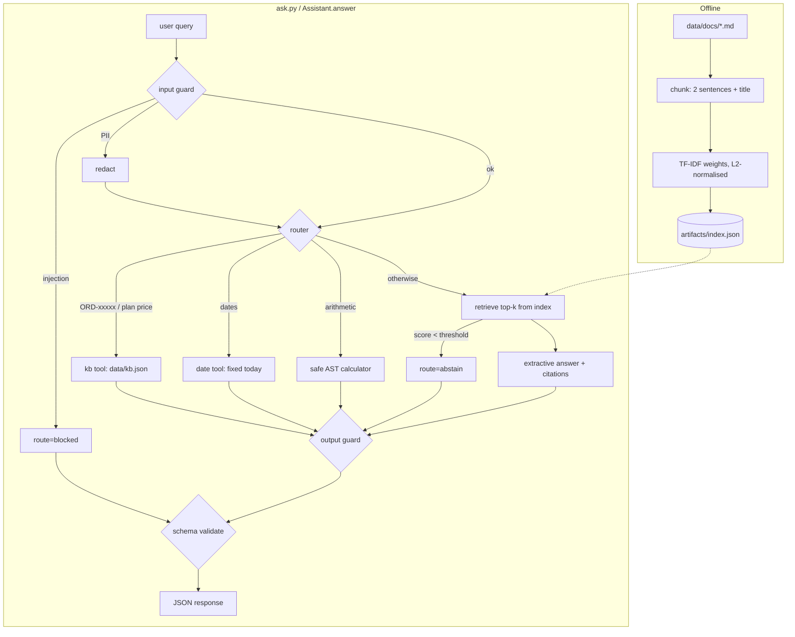

# ai-learn-14-end-to-end-ai-assistant

**Phase C milestone** of the AI learning track (the AI counterpart of `ml-learn-12-end-to-end-classification`). It is a small but complete help-desk assistant for a fictional product, "Acme Cloud", and it combines the earlier days into one app:

| piece | from | here |
|---|---|---|
| TF-IDF retrieval and index | ai-learn-07 / 08 | `assistant/index.py` builds and saves `artifacts/index.json` |
| RAG with an extractive answerer and citations | ai-learn-08 | `Assistant._rag` |
| tool calling (calculator, date, KB) and routing | ai-learn-09 | `assistant/tools.py`, `Assistant.route` |
| eval harness (pass rate, Hit@k/MRR, ablation) | ai-learn-10 | `evaluate.py` |
| guardrails and structured JSON output | ai-learn-13 | `assistant/guards.py`, `assistant/schema.py` |

Pure Python plus NumPy. No LLM APIs, no network, deterministic output, and the full smoke run takes well under a second on CPU.

## What you'll learn

- How to wire ingestion → index artifact → retrieval → generation → tools → guardrails → schema-validated JSON into one testable app with a CLI.
- How to evaluate a whole assistant: route accuracy, answer pass rate, retrieval Hit@k/MRR, guardrail block precision/recall, schema-valid rate and latency.
- How an **ablation** (tools off) shows what each component contributes, and how a paraphrase split exposes the limits of lexical retrieval.

## Architecture



Every response has this shape and is validated before it is returned:

```json
{"query": "...", "route": "rag|calculator|date|kb|blocked|abstain", "answer": "...",
 "citations": ["password#0"], "tool_calls": [{"tool": "...", "input": "...", "output": "..."}],
 "guardrails": {"input": "allow|redact|block", "output": "allow|redact|block|skipped"},
 "confidence": 0.55, "latency_ms": 0.1}
```

## Layout

| path | purpose |
|---|---|
| `build_index.py` | CLI: ingest `data/docs` and write `artifacts/index.json` |
| `ask.py` | CLI: `python ask.py "question"` for a single JSON answer, or `python ask.py` for a REPL |
| `evaluate.py` | CLI: run `data/eval_set.json` (`--no-tools` for the ablation, `--out report.json`) |
| `run_smoke.py` | end-to-end smoke: build, sample asks, eval, ablation, then writes `results/` |
| `assistant/index.py` | tokenizer, chunker, TF-IDF build/save/load/search |
| `assistant/tools.py` | safe calculator (AST whitelist), date arithmetic, KB lookup |
| `assistant/guards.py` | injection patterns, PII redaction, output canary and toxicity checks |
| `assistant/schema.py` | from-scratch validator and `RESPONSE_SCHEMA` |
| `assistant/core.py` | `Assistant`: guard → route → answer → guard → validate |
| `data/docs/` | 11 help-center articles (the knowledge base for RAG) |
| `data/kb.json` | structured records for the KB tool (orders, plan prices) |
| `data/eval_set.json` | 44 labeled cases: 20 direct + 5 paraphrased RAG (2 of them with PII), 4 calculator, 4 date, 4 KB, 4 injection, 3 out-of-scope |
| `artifacts/index.json` | the saved index artifact (committed; rebuild with `build_index.py`) |
| `notebooks/assistant_walkthrough.ipynb` | walkthrough of each stage |

## Run

```bash
pip install -r requirements.txt
python build_index.py                     # -> artifacts/index.json
python ask.py "How long is the password reset link valid?"
python ask.py                             # interactive REPL
python evaluate.py                        # eval summary
python evaluate.py --no-tools             # ablation
python run_smoke.py                       # everything, rewrites results/
```

## Headline results (from `results/metrics.json`)

- Eval suite (44 cases): **pass rate 0.909**, route accuracy 0.955, schema-valid responses 1.0, p95 latency about 0.1 ms.
- Retrieval: Hit@1 **0.88**, MRR@5 0.893. Direct wording gets Hit@1 1.0, **paraphrases only 0.4**.
- Guardrails: injection block precision/recall 1.0/1.0 on the 4 probes, and 2/2 PII queries redacted and still answered.
- Ablation without tools: pass rate drops to **0.636** (every calculator, date and KB case fails).

## Limitations and next steps

The retrieval is lexical, so paraphrases fail. Dense embeddings (ai-learn-06) or query expansion are the natural next step. The extractive answerer sometimes appends a loosely related second sentence. The router and guards are regex-based and easy to evade. The eval set is small and hand-written.
